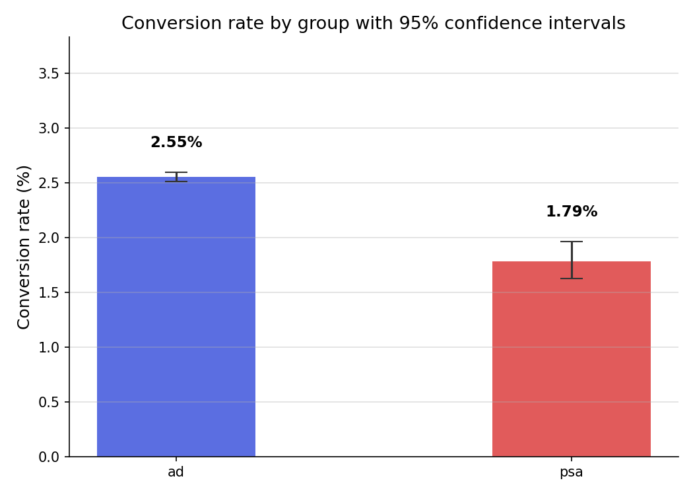
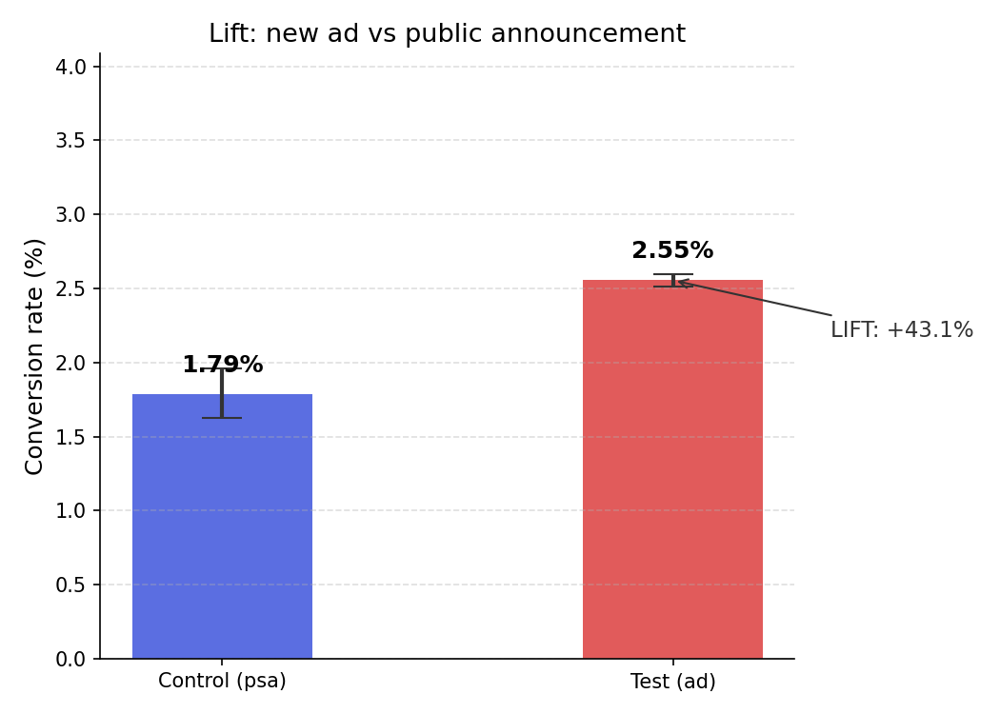
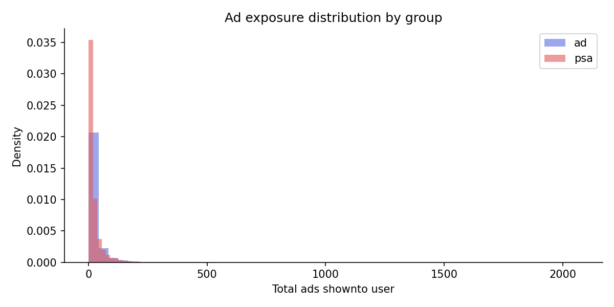
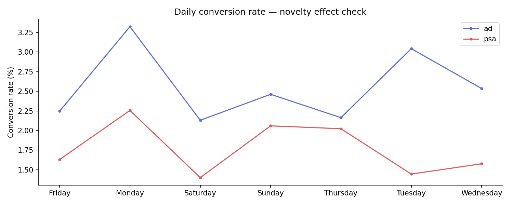

# Marketing Campaign A/B Test Analysis  (Task 10- Industry Level)

## Goal
Determine whether the new ad (Test Group) drove significantly more purchases
than the Public Service Announcement (Control Group), using statistical hypothesis testing
at a 95% confidence level.

## Business Question
The Marketing Department ran two different campaigns to sell a product:
did the new ad actually drive more purchases, or was the difference just luck?

## Project Structure
```
ab_test_project/
├── data/
│   └── marketing_AB.csv              ← download from Kaggle (not tracked in git)
├── notebooks/
│   ├── data_setup.ipynb              ← load, clean, and validate the dataset
│   ├── eda.ipynb                     ← exploratory data analysis
│   ├── hypothesis_test.ipynb         ← Z-test / Chi-Square, p-value
│   └── results.ipynb                 ← final results, lift, confidence intervals, bonus
├── outputs/
│   └── plots/
│       ├── ad_exposure.png           ← distribution of ad exposure per group
│       ├── conversion_rates.png      ← conversion rate: Test vs Control
│       ├── lift_chart.png            ← lift with confidence intervals
│       └── time_trend.png            ← conversions over time (day / hour)
├── src/                              ← reusable helper functions
├── .gitignore
├── requirements.txt
└── README.md
```

## Dataset
Marketing A/B Testing Dataset (Kaggle):
https://www.kaggle.com/datasets/faviovaz/marketing-ab-testing

Place the downloaded file at `data/marketing_AB.csv`.

## Methodology
1. **Data setup**: load the data, check for missing values and duplicates, confirm the group split.
2. **EDA**: compare group sizes, ad exposure, and conversion behavior over time.
3. **Hypothesis test**
   - H0: the conversion rates of the Test and Control groups are equal.
   - H1: the conversion rates are different.
   - Test: two-proportion Z-test (and Chi-Square as a cross-check), significance level α = 0.05.
4. **Results and bonus**
   - Absolute and relative lift in conversion rate, with confidence intervals.
   - Estimated number of additional customers if the new ad were rolled out to 100% of users.

## Key Findings
> Fill in with your final numbers from `notebooks/results.ipynb`.

| Metric | Control (PSA) | Test (Ad) |
|---|---|---|
| Users | | |
| Conversions | | |
| Conversion rate | | |

- **Absolute lift:** 
- **Relative lift:** 
- **p-value:** 
- **Conclusion:** (statistically significant / not significant at 95% confidence)
- **Projected extra customers at 100% rollout:** 

## Visualizations
| | |
|---|---|
|  |  |
|  |  |

## How to Run
```bash
# 1. Create and activate a virtual environment
python -m venv venv
source venv/bin/activate          # Windows: venv\Scripts\activate

# 2. Install dependencies
pip install -r requirements.txt

# 3. Add the dataset to data/marketing_AB.csv, then launch Jupyter
jupyter notebook
```

Run the notebooks in this order:
1. `notebooks/data_setup.ipynb`
2. `notebooks/eda.ipynb`
3. `notebooks/hypothesis_test.ipynb`
4. `notebooks/results.ipynb`

## Tools & Libraries
Python, Pandas, NumPy, SciPy, Statsmodels, Matplotlib / Seaborn, Jupyter Notebook

## Covered Topics
A/B Testing | Conversion Rate Optimization (CRO) | Statistical Inference
